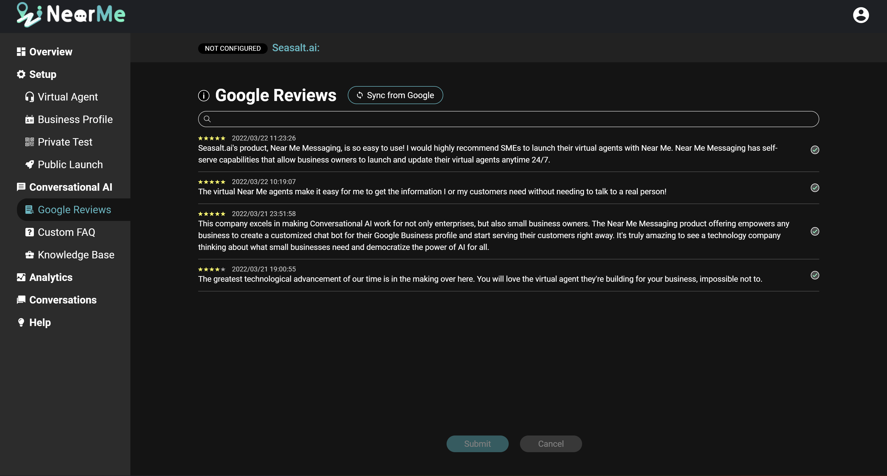

There are three main ways to improve your Near Me Messaging virtual agent if it is struggling to respond to certain questions: filtering your Google Reviews, adding custom FAQs, and adding to your knowledge base.

For a video walkthrough of this content, please take a look at our video:

   <iframe width="100%" height="10%" src="https://www.youtube.com/embed/sWhigyIh3Gw" title="YouTube video player" frameborder="0" allow="accelerometer; autoplay; clipboard-write; encrypted-media; gyroscope; picture-in-picture" allowfullscreen style="border-radius: 30px;"></iframe>

## Filter Your Google Reviews

You can control which of your Google Reviews are used by your virtual agent to answer customer questions on the Google Reviews. If a review contains inaccurate or outdated information, you can easily remove it from your virtual agent’s use.

To remove a review, uncheck the box next to it and click the submit button. The virtual agent will now only use the checked reviews when it searches for an answer to a customer question. The unchecked review will remain on the page if you ever want to include it again.

## Add Custom FAQs

If you notice that customers ask particular questions a lot or see a common question in your unanswered questions, you can add a specific answer to those questions on the Custom FAQ page. This is the best way to improve your agent if you want a group of similar questions to be answered in a specific way.

To create a new custom FAQ, enter a question and answer, and click the arrow. You can now click Paraphrase the Question to add more questions that should trigger this answer. The more paraphrases you provide, the better the virtual agent will be able to use this FAQ. When you are done updating your custom FAQs, click Save All to save your new FAQs.

## Add to Knowledge Base

The other way in which you can add more information for your virtual agent’s use is through the Knowledge Base page. This is the best way to improve your agent if you have a paragraph of information about your business that you want your agent to have access to. If you add information here, your virtual agent will search this context in addition to your Google Reviews when it tries to answer a customer’s question. The virtual agent will not answer with the full context paragraph, but may pick a section of it to answer a customer’s question.

To add a new context paragraph, enter an informative title and the paragraph, then click the check. When you are done updating your knowledge base, click Save All to save your new information.

## Summary

Both the Custom FAQs and the Knowledge Base allow you to add custom information about your business that your virtual agent can use when answering your customers. These two resources are best used in different ways, and have their own strengths and weaknesses.

With the Custom FAQs, you can get your virtual agent to give your customers a very specific answer to a set of questions. This can help you to provide an accurate answer to a question that you see coming in frequently from your customers. However, while the system has some flexibility to match similar questions to the paraphrases you provide on the Custom FAQ page, your virtual agent will be able to use your Custom FAQs better if you provide as many paraphrases as possible, which can be a tedious process.

With the Knowledge Base, you can quickly and easily provide your virtual agent with a large amount of information about your business, simply by copying and pasting text from your website or marketing materials directly into the Knowledge Base page. This instantly gives your virtual agent verified, accurate and up-to-date information about your business. However, you don't have control over what questions will cause your virtual agent to pull from the Knowledge Base, so it may occasionally give an answer that is not quite on topic.

In essence, if your virtual agent was a dartboard, the Custom FAQs are like hitting the bullseye. They are very accurate, but it can take some time and practice to hit the bullseye every time. On the other hand, the Knowledge Base is like throwing a handful of darts at the board at once. You're very likely to hit the board, and may even hit the bullseye sometimes, but you may also loose a dart off to the side.