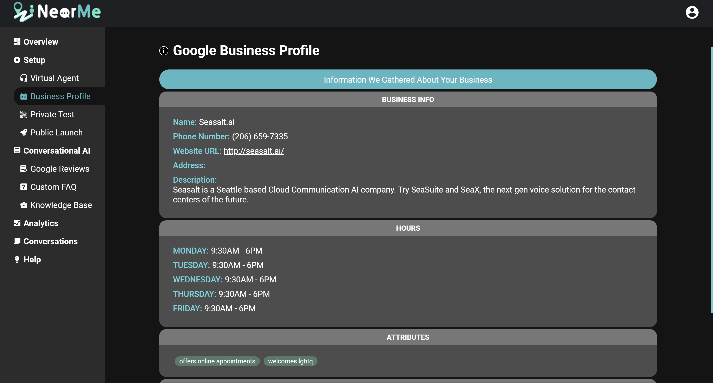

Overview Page
-------------

This is the Overview Page for your virtual agent. From here you can see information about your agent and its performance, as well as further customize your agent.

Update Business Information
---------------------------

You can view the information we have collected about your business on the Business Profile page. This includes contact information like your phone number, address and website, your business hours, Google Business attributes, and Google Maps labels. If you need to change or update any information on this page, please use [business.google.com](https://business.google.com) or the Google Business Profile app, then click *"Sync"* on the Locations Page to update this information.

Google Reviews
---------------
You can also view the collected Google Reviews for your business on the Google Reviews Page.

Next up: Test and Publish Virtual Agent
------------------------------
In the next section, we will show you how to publish virtual agent to Google Maps and start serving your customers.
