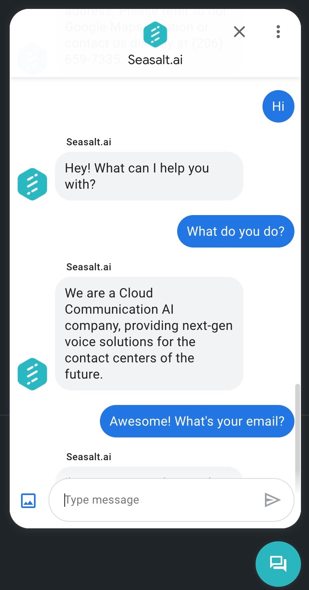
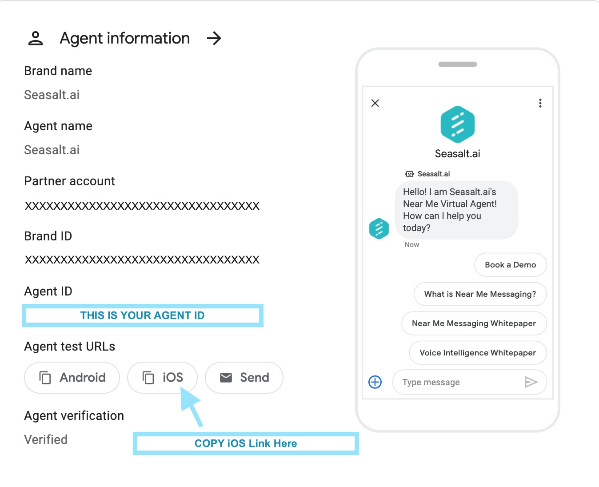

You can add Near Me virtual agent to your own website, just like the virtual agent widget you see on this Wiki.


<a href="images/chat_button.jpg"></a>

Adding this widget allows your visitor to chat with Near Me virtual agent on your website too!

<a href="images/chat_window.jpg"></a>


### Embed Code to Enable Google Chat Widget

To embed the Google chat widget, please **update the following values to create a Business Messages widget** and add this code snippet to the html file of your website. After this step, you should see the chat button popping up on the lower right corner.


You can find the required information on [Google Business Communication Console](https://business-communications.cloud.google.com/console/), and then replace the values in the code snippet.

- Agent ID: this is your agent id. Replace `AGENT_ID` with this value.
- iOS Link: You need to modify the raw iOS link before inserting into your widget code. This URL redirects your visitors on iPhones. 

<a href="images/ids.jpg"></a>


```html
<link type="text/css" href="https://www.gstatic.com/business-messages/v2/bm_widget_button.css" rel="stylesheet">
<link type="text/css" href="https://wiki.seasalt.ai/google-widget.css" rel="stylesheet">
<script crossorigin="use-credentials" src="https://businessmessages.google.com/widget/v2/js?cb=initWidget"></script>
<script type="text/javascript">
window.mobileCheck = function() {
    let check = false;
    (function(a){if(/(android|bb\d+|meego).+mobile|avantgo|bada\/|blackberry|blazer|compal|elaine|fennec|hiptop|iemobile|ip(hone|od)|iris|kindle|lge |maemo|midp|mmp|mobile.+firefox|netfront|opera m(ob|in)i|palm( os)?|phone|p(ixi|re)\/|plucker|pocket|psp|series(4|6)0|symbian|treo|up\.(browser|link)|vodafone|wap|windows ce|xda|xiino/i.test(a)||/1207|6310|6590|3gso|4thp|50[1-6]i|770s|802s|a wa|abac|ac(er|oo|s\-)|ai(ko|rn)|al(av|ca|co)|amoi|an(ex|ny|yw)|aptu|ar(ch|go)|as(te|us)|attw|au(di|\-m|r |s )|avan|be(ck|ll|nq)|bi(lb|rd)|bl(ac|az)|br(e|v)w|bumb|bw\-(n|u)|c55\/|capi|ccwa|cdm\-|cell|chtm|cldc|cmd\-|co(mp|nd)|craw|da(it|ll|ng)|dbte|dc\-s|devi|dica|dmob|do(c|p)o|ds(12|\-d)|el(49|ai)|em(l2|ul)|er(ic|k0)|esl8|ez([4-7]0|os|wa|ze)|fetc|fly(\-|_)|g1 u|g560|gene|gf\-5|g\-mo|go(\.w|od)|gr(ad|un)|haie|hcit|hd\-(m|p|t)|hei\-|hi(pt|ta)|hp( i|ip)|hs\-c|ht(c(\-| |_|a|g|p|s|t)|tp)|hu(aw|tc)|i\-(20|go|ma)|i230|iac( |\-|\/)|ibro|idea|ig01|ikom|im1k|inno|ipaq|iris|ja(t|v)a|jbro|jemu|jigs|kddi|keji|kgt( |\/)|klon|kpt |kwc\-|kyo(c|k)|le(no|xi)|lg( g|\/(k|l|u)|50|54|\-[a-w])|libw|lynx|m1\-w|m3ga|m50\/|ma(te|ui|xo)|mc(01|21|ca)|m\-cr|me(rc|ri)|mi(o8|oa|ts)|mmef|mo(01|02|bi|de|do|t(\-| |o|v)|zz)|mt(50|p1|v )|mwbp|mywa|n10[0-2]|n20[2-3]|n30(0|2)|n50(0|2|5)|n7(0(0|1)|10)|ne((c|m)\-|on|tf|wf|wg|wt)|nok(6|i)|nzph|o2im|op(ti|wv)|oran|owg1|p800|pan(a|d|t)|pdxg|pg(13|\-([1-8]|c))|phil|pire|pl(ay|uc)|pn\-2|po(ck|rt|se)|prox|psio|pt\-g|qa\-a|qc(07|12|21|32|60|\-[2-7]|i\-)|qtek|r380|r600|raks|rim9|ro(ve|zo)|s55\/|sa(ge|ma|mm|ms|ny|va)|sc(01|h\-|oo|p\-)|sdk\/|se(c(\-|0|1)|47|mc|nd|ri)|sgh\-|shar|sie(\-|m)|sk\-0|sl(45|id)|sm(al|ar|b3|it|t5)|so(ft|ny)|sp(01|h\-|v\-|v )|sy(01|mb)|t2(18|50)|t6(00|10|18)|ta(gt|lk)|tcl\-|tdg\-|tel(i|m)|tim\-|t\-mo|to(pl|sh)|ts(70|m\-|m3|m5)|tx\-9|up(\.b|g1|si)|utst|v400|v750|veri|vi(rg|te)|vk(40|5[0-3]|\-v)|vm40|voda|vulc|vx(52|53|60|61|70|80|81|83|85|98)|w3c(\-| )|webc|whit|wi(g |nc|nw)|wmlb|wonu|x700|yas\-|your|zeto|zte\-/i.test(a.substr(0,4))) check = true;})(navigator.userAgent||navigator.vendor||window.opera);
    return check;
};
function openPage(){
    window.open('<iOS_LINK>', '_blank');
};
// Convert HTML element with ID = myCustomButton into a Business Messages widget
function initWidget() {
    // Check that the user has a supported device
    if (window.bmwidget.supported) {
    document.getElementById('google-widget').style.display = "block";
    window.bmwidget.init(document.getElementById('google-chat'), {
        'agentId': '<AGENT_ID>',
        'context': 'eyJwcm9kdWN0IjoiZHJ5ZXIiLCJvZmZlci1jb2RlIjoiQVNEQURTQSJ9Cg=='
    });
    } else if (window.mobileCheck()) {
    document.getElementById('google-widget').style.display = "block";
    document.getElementById("google-chat").onclick = function() { 
        openPage() 
    };
    } else {
    document.getElementById('google-widget').style.display = "block";
    document.getElementById('google-tip').style.opacity = 0;
    document.getElementById('google-tip').textContent = 'Chat is only supported on mobile devices. Please open this page on your Android or iPhone.'
    document.getElementById("google-chat").onclick = function() { 
        if (document.getElementById('google-tip').style.opacity == 1) {
        document.getElementById('google-tip').style.opacity = 0;
        } else {
        document.getElementById('google-tip').style.opacity = 1;
        }
    };
    }
};
</script>
<div id="google-widget">
<button id="google-chat" data-bm-widget-layout="floating">
    <span id="google-tip" class="bm-widget-button-text tip" role="tooltip">Chat with Seasalt.ai</span>
</button>
</div>
```

### Tips on iOS

If you replace the iOS link that you copied from Google Business Communication Console, the button will need an additional verification step before the user can chat with your virtual agent. For better user experience, you can do the following to skip the verification step. 

The raw iOS link that you copy from [Google Business Communication Console](https://business-communications.cloud.google.com/console/) is in this format: 

```
https://business-messages-launcher.appspot.com?url=https%3A%2F%2Fbusiness.google.com%2Fmessage%3Fargs%3DXXXXXXXXXXXXXXXXXXX
``` 

Please decode the URL (you can decode at [this website](https://www.utilities-online.info/urlencode)) and then remove `https://business-messages-launcher.appspot.com?url=` from the iOS link. 

Your final iOS link to insert should look this this before insertion: 
```
https://business.google.com/message?args=XXXXXXXXXXXXXXXXXXXXXXXXXXXXXXXXXXXXXXXX
```


### Devices

Right now, we only support live chat on mobile (Android and iPhone). On desktop, the visitors of your website can still see the chat button, but the widget will suggest 'Chat is only supported on mobile devices. Please open this page on your Android or iPhone' on click. The Near Me Team will update all users when we can support the chat button feature on desktop too. Stay tuned!
