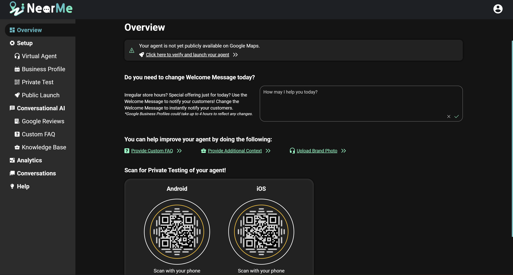
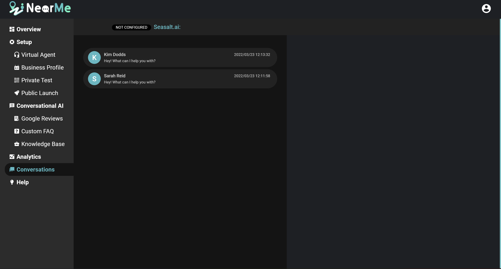

For a video walkthrough of this content, please take a look at our video:

   <iframe width="560" height="315" src="https://www.youtube.com/embed/26OIrHmIRQI" title="YouTube video player" frameborder="0" allow="accelerometer; autoplay; clipboard-write; encrypted-media; gyroscope; picture-in-picture" allowfullscreen style="border-radius: 30px;"></iframe>

## Agent Overview

The Overview Page is the first page you see in your agent’s portal, and gives you basic information about your agent at a glance. At the top of the page you will see the launch status of your agent. Once your agent is publicly launched, you will also see some basic statistics about your agent here as well.

The Welcome Message section allows you to change the first message your customers see when they start chatting with your virtual agent. This is a good place to put short term information you want your customers to know, like irregular hours or daily offerings.

The Improvements section provides helpful links to other pages where you can provide custom information to improve the performance of your virtual agent. See the Improve You Agent section for more information about these methods.

Once your virtual agent is launched, the Unanswered Questions section will show you common questions that your virtual agent is struggling to answer. This is a great starting point to add more FAQs to improve your agent.

Finally, the Overview page has your Private Testing QR codes and links to the Public Launch page, for easy access to your virtual agent.

## NearMe Analytics

The Analytics Page gives you an in-depth look at your virtual agent’s performance.

The Metrics section gives you a quick look at important metrics and trends in a number of categories. Here you can see the number of conversations, the number of messages received and sent, the number of unique visitors who talked to your agent, the number of times a customer requested a live agent, and the number of days your virtual agent has been online. You can specify the date range you want to see numbers for.

The Conversation Overview section shows you a list of conversations that your virtual agent has participated in. You can see the average response time of your virtual agent and the average number of messages per conversation, as well as how many different Google Business Attributes each customer asked about. You can also click on a customer’s name to see the full chat history with that customer on the Conversations Page.

The Busy Hours section shows you a graph of when your customers are contacting your virtual agent.

The Unanswered Questions section shows you a list of the most common questions that your virtual agent had difficulty answering. This is a great starting point to improve your agent, by answering the most common unanswered questions on the Custom FAQ page.

The Google Business Attribute Overview section shows you the most common Google Business Attributes that come up in customer questions. This is a great place to look to see what your customers are curious about. It also shows the most common Google Business Attributes that are asked about, but do not appear on your Google Maps page. You can improve your agent by adding information about these missing attributes at https://business.google.com or on the Google Business Profile app.

The Customer Review Insights section shows you the most common topics that appear in your Google Reviews. This is a great place to look to get an idea of what your customers are saying in your reviews, without having to read through all of them.

## Conversations

The Conversations Page provides you with a very close look at what is going on with your virtual agent. Here you can directly view the entire chat history with a customer, and see exactly what happened in a conversation with your virtual agent and how it responded to a customer’s questions.

You can also directly speak to your customers on this page. If one of your customers requests to speak to you directly, your virtual agent can transfer the chat over to you, and you can join the conversation directly with your customer.
