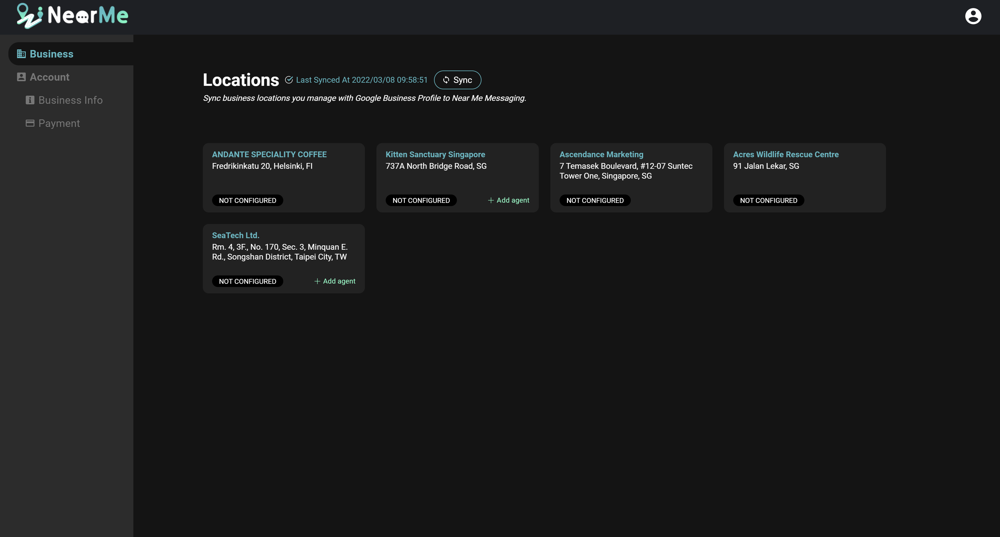
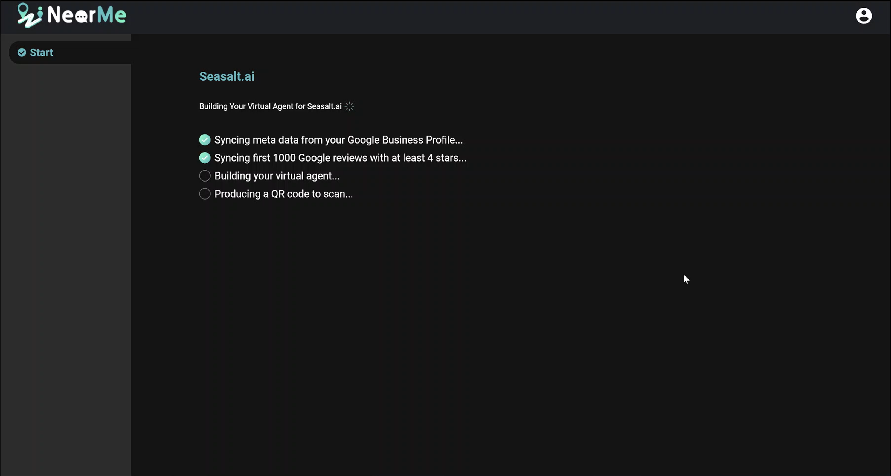
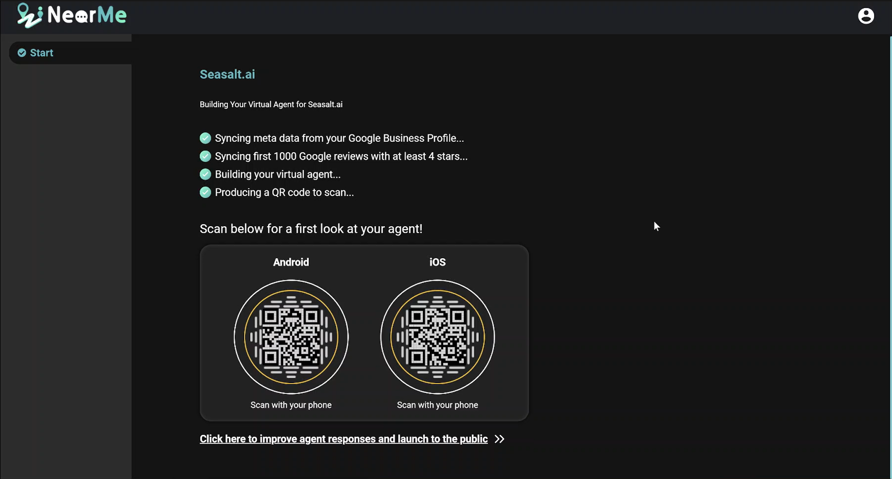

For a video walkthrough of this content, please take a look at our video:

   <iframe width="100%" height="10%" src="https://www.youtube.com/embed/fgf2nt4FkfE" title="YouTube video player" frameborder="0" allow="accelerometer; autoplay; clipboard-write; encrypted-media; gyroscope; picture-in-picture" allowfullscreen style="border-radius: 30px;"></iframe>

Sync with Google Business Profile Account
-------------------------------------

To begin setting up your virtual agent, navigate to the Business tab in the Near Me Messaging Portal. Here you will see the business locations associated with your Google account. If you don’t see your locations, ensure that you are logged in with the account associated with your Google Business Profile account, and click on the *"Sync"* button to resync your locations.

Create an Agent
---------------

To create your virtual agent, click the Add Agent button on the location card. Your virtual agent will automatically start creating, and you will see the progress of the agent building.

Test/Chat with Near Me Agent
----------------------------

When your agent is finished building, you will see test QR codes on your screen. Scanning these QR codes will bring you to a private test version of your virtual agent. This version of your virtual agent will not appear on Google Maps yet, but you can talk to it and test the responses.

Next up: Manage Business Info
-----------------------------
Click on the link below the QR codes to go to virtual agent's Overview page. We will customize your business information in the next section.