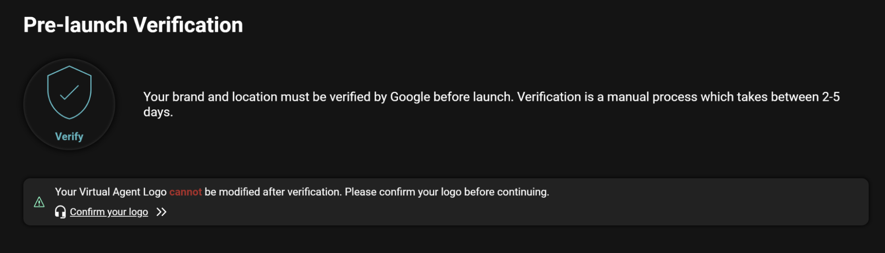
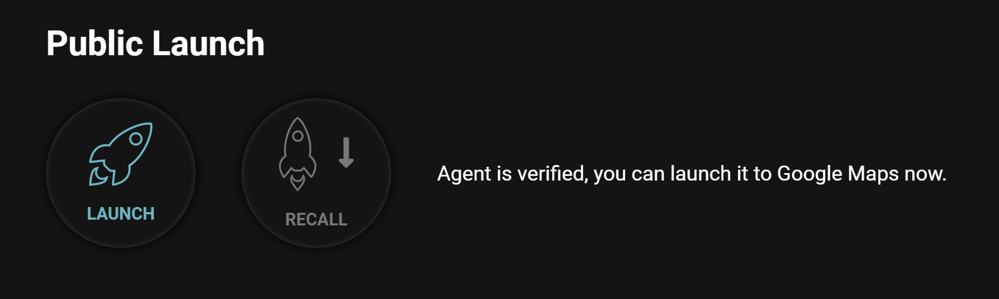
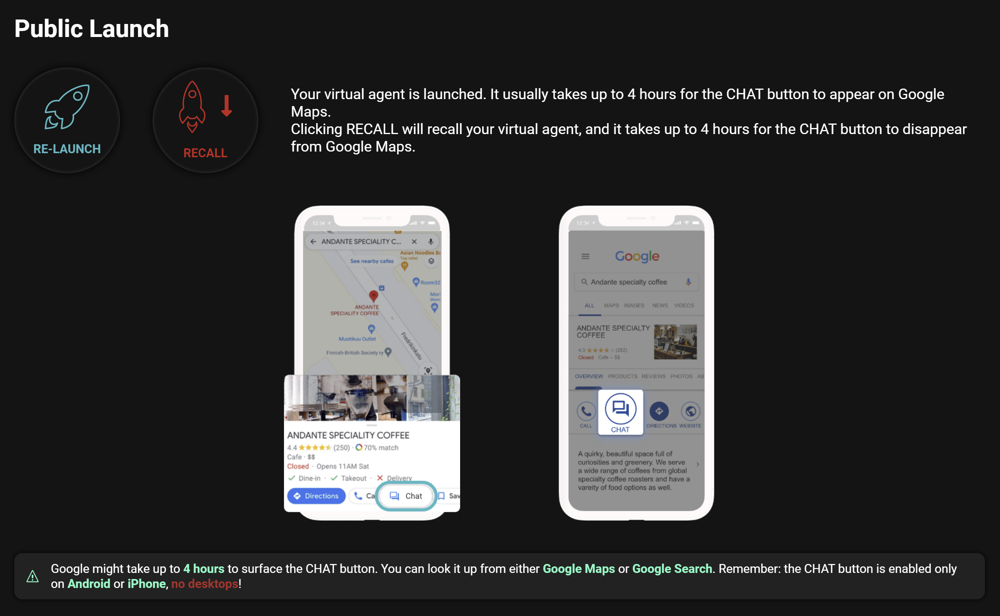

Before you publish the virtual agent to publish, you can test/chat with Private Testing Agent first. Let's understand what's the difference between Private Testing Agent and Public Launch Agent first.

There are two versions of your virtual agent that you control through the Near Me Messaging Portal, the Private Testing Agent and the Public Launch Agent.

### Private Testing Agent

The Private Testing Agent is the version of your agent that is automatically created when you first add an agent in the Near Me Messaging Portal. You can talk to the Private Testing Agent by scanning the QR codes on the agent page, but it is not publicly available on Google Maps. The Private Testing Agent is also the version of your agent that is updated when you make changes in the Near Me Messaging Portal.

### Public Launch Agent

The Public Launch Agent is the version of your agent that is publicly available to your customers on Google Maps. You can talk to the Public Launch Agent only by clicking on the Chat button on Google Maps. The Public Launch Agent is not automatically created, but must be launched once you are happy with any changes you make in the Near Me Messaging Portal.

The first step of publicly launching your virtual agent is verifying your brand and location with Google, accessible from the Public Launch Page.

 > You cannot change your virtual agent’s logo after verification, so make sure that your logo is final before verification.

Once your brand and location are verified, you can publicly launch your virtual agent. Once the chat button appears on Google Maps, your virtual agent is available to your customers to chat with.

> It can take up to four hours for the chat button to appear on Google Maps. 

> As changes made in the Near Me Messaging Portal only directly affect the Private Testing Agent, you will need to relaunch your Public Launch Agent if you make changes after your initial launch.

Once your agent is launched, your Public Launch page will look like this. From here you can relaunch your agent if you have made changes in the Near Me Messaging Portal, or Recall your agent and remove it from Google Maps.

